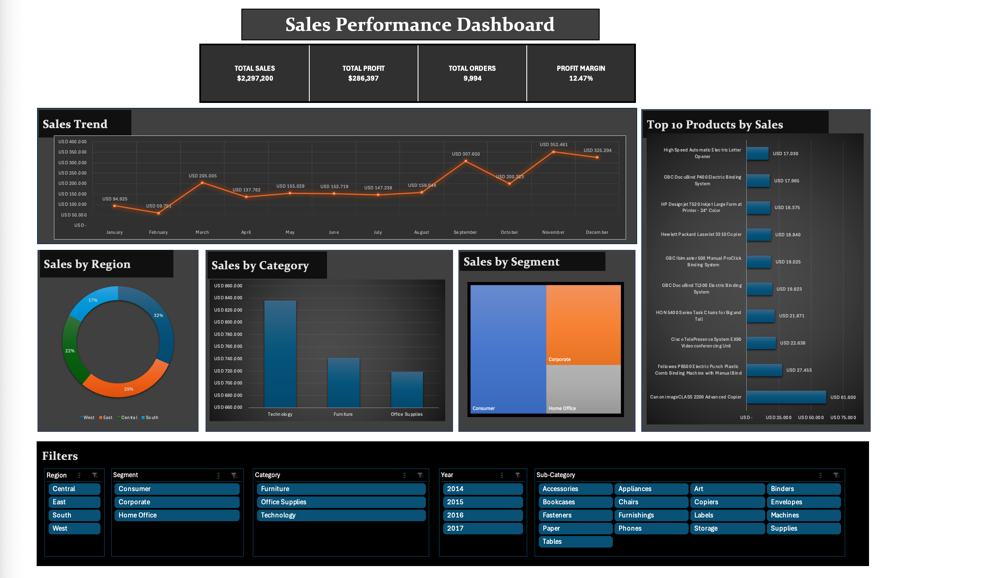
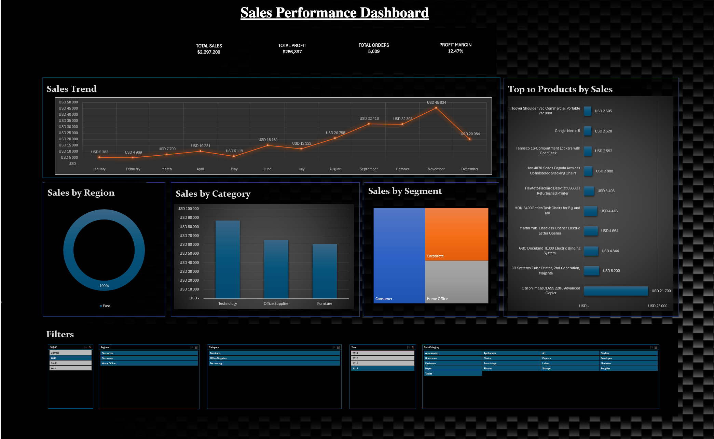
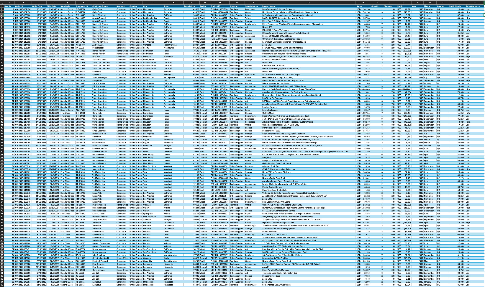
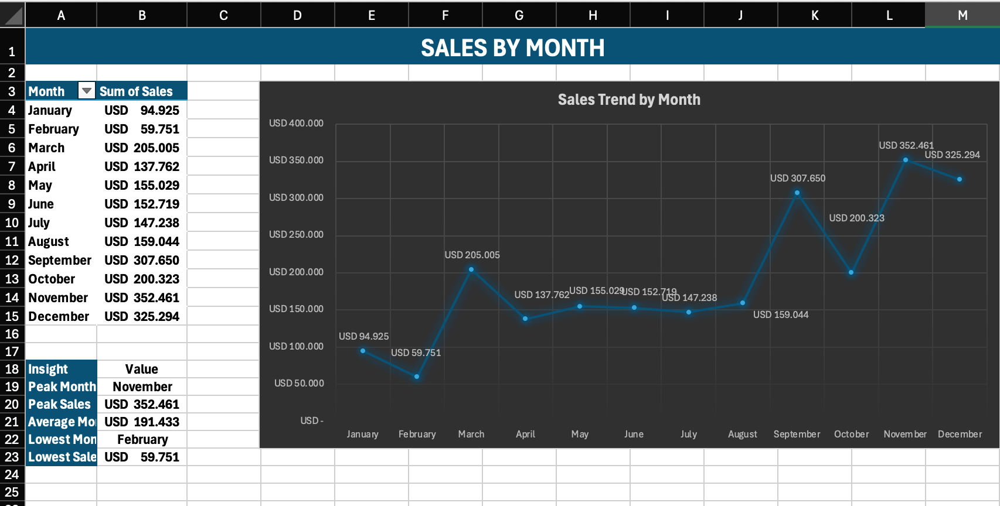

# 📊 Superstore Sales Performance Dashboard (Excel)


## 🚀 Project overview

In this project, I built an interactive **Sales Performance Dashboard** entirely in **Microsoft Excel**, using the Superstore dataset to analyze sales, profitability, customer segments, product performance, and regional trends.

My objective was to turn raw transactional data into an interactive business intelligence dashboard that monitors sales performance, uncovers key trends, and supports data-driven decision-making.

I combined **PivotTables**, **PivotCharts**, **KPI Cards**, **Slicers**, and other **interactive filters** to provide a comprehensive view of business performance.

---

## Dashboard Preview

### Executive Dashboard



### Interactive Filtering Example



---

## Business Questions Answered

This dashboard helps answer the following questions:

* Which product category generates the highest sales?
* Which region performs best?
* How do sales evolve over time?
* Which customer segment contributes the most revenue?
* Which products generate the highest sales?
* How does performance change when filtering by year, category, region, or segment?

---

## Key Performance Indicators (KPIs)

The dashboard tracks:

* 💰 Total Sales
* 📈 Total Profit
* 🛒 Total Orders
* 📊 Profit Margin %

---

## Dashboard Components

### Sales Trend

Analyzes monthly sales performance and identifies seasonality patterns.

### Sales by Category

Compares revenue generated across product categories.

### Sales by Region

Evaluates regional sales performance.

### Sales by Segment

Shows contribution of each customer segment.

### Top 10 Products

Highlights the best-performing products by sales.

### Interactive Filters

Users can dynamically filter the dashboard using:

* Region
* Category
* Segment
* Year
* Sub-Category

---

## Dataset

The project uses the **Sample Superstore Dataset** containing approximately:

* 5,009 Orders
* Customer Information
* Product Information
* Sales Data
* Profit Data
* Regional Information
* Order Dates

---

## Excel Skills Demonstrated

### Data Preparation

* Data Cleaning
* Data Validation
* Data Structuring

### Analysis

* Pivot Tables
* Pivot Calculations
* KPI Development
* Business Analysis

### Visualization

* Pivot Charts
* Treemap Charts
* Line Charts
* Bar Charts
* Dashboard Design

### Interactivity

* Slicers
* Dynamic Filtering
* Interactive Reporting

---

## Project Workflow

### 1. Data Preparation

* Imported dataset
* Cleaned and validated data
* Created supporting calculations

### 2. Analysis Layer

Built multiple Pivot Tables to analyze:

* Category Performance
* Regional Performance
* Monthly Sales Trends
* Product Performance
* Customer Segments

### 3. Dashboard Development

Created an interactive dashboard featuring:

* KPI Cards
* Dynamic Charts
* Interactive Slicers
* Business Insights

---

## Repository Structure

```text
excel-sales-performance-dashboard/
│
├── data/
│   └── Superstore_Sales.csv
│
├── dashboard/
│   └── Excel_Sales_Performance_Dashboard.xlsx
│
├── images/
│   ├── dashboard_overview.png
│   ├── dashboard_filtered.png
│   ├── raw_data_sample.png
│   └── pivot_analysis.png
│
├── README.md
│
└── LICENSE
```

---

## Sample Data



---

## Pivot Analysis Example



---

## Key Insights

* Consumer customers generated the highest sales volume.
* Technology was the highest-performing category.
* Sales showed strong growth during peak seasonal periods.
* A small number of products accounted for a significant share of revenue.
* Regional performance varied considerably across markets.

---

## Tools Used

* Microsoft Excel
* Pivot Tables
* Pivot Charts
* Slicers
* Dashboard Design Techniques

---


## Author

### Saad Maher

Data Analyst focused on transforming raw data into clear insights using **Python, SQL, Excel, and Power BI**.

[](https://github.com/Immobre)
[](https://www.linkedin.com/in/saad-m-83b846356/)

*Feel free to explore my other projects and connect with me.*


---

## License

This project is licensed under the MIT License.

